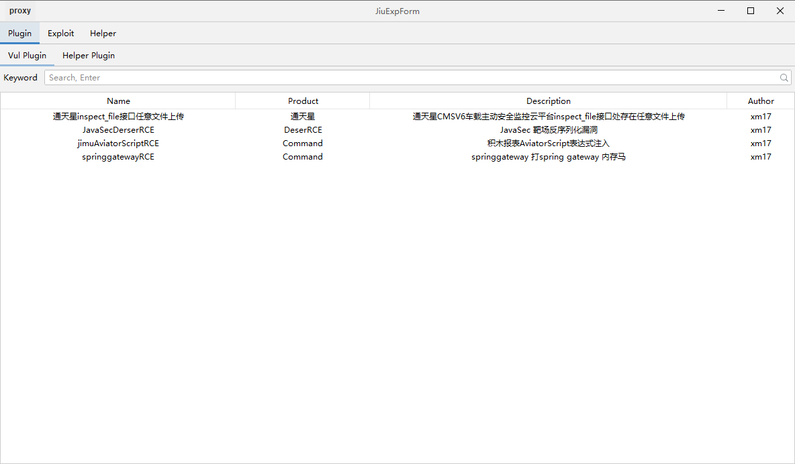

# 简介
一款模仿woodpecker 可高度定制化的漏洞利用工具,持续更新中




# 编写必知

1. 请参考`org.jiu.exploit`下的目录中任意一个代码文件
2. 修改下面的参数,`className`必须写全名,其他参数请参考注释
```java
// 修改下面参数
public String name = "JavaSecDerserRCE"; // 漏洞名
public String product = "DeserRCE";             // 类型
public String desc = "JavaSec 靶场反序列化漏洞";  // 描述
public String author = "xm17";              // 作者
public String className = "org.jiu.exploit.javasec.JavaSecDerserRCE"; // 类名(必须)
public String tabName = "JavaSecDerserRCE";  // tab显示名称
public String tips = "JavaSec 靶场反序列化漏洞 使用的是woodpecker-ysoserial 命令自己参考一下";    // 提示
```


# 编写代码

## 编译命令

```bash
mvn clean package -DskipTests
```


## 加载woodpecker-ysoserial

1. 首先需要在pom中引入woodpecker-ysoserial
2. 注释的内容为只在编译时引入该依赖,打包后会删除该依赖
3. 如果在编译和运行时引入该依赖，打包后的jar包会包含该依赖且会很大

```xml
<dependency>
      <groupId>ysoserial-woodpecker</groupId>
      <artifactId>ysoserial-woodpecker</artifactId>
      <version>0.5.3</version>
<!--      <scope>system</scope>-->
<!--      <systemPath>${custom.lib-path}/ysoserial-for-woodpecker-0.5.3-all.jar</systemPath>-->
    </dependency>
```

## 如何使用反序列化

1. 需要在ui组件的gadgetcomboBox中添加需要的依赖,如`CommonsBeanutils1`
2. 然后参考JavaSecDerserRCE使用


## 外部依赖

可以在打包生成好的jar包同目录创建`lib`文件夹,存放依赖的jar包,程序初始化会使用类加载调用


## 